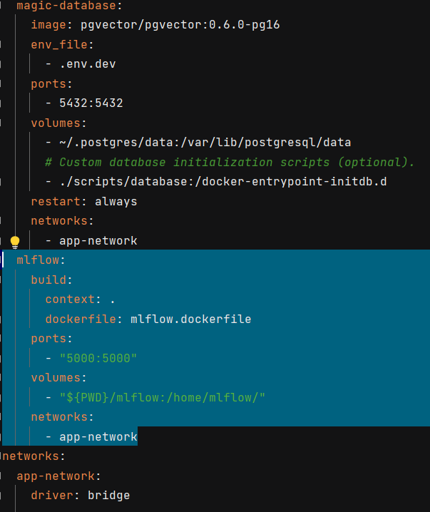
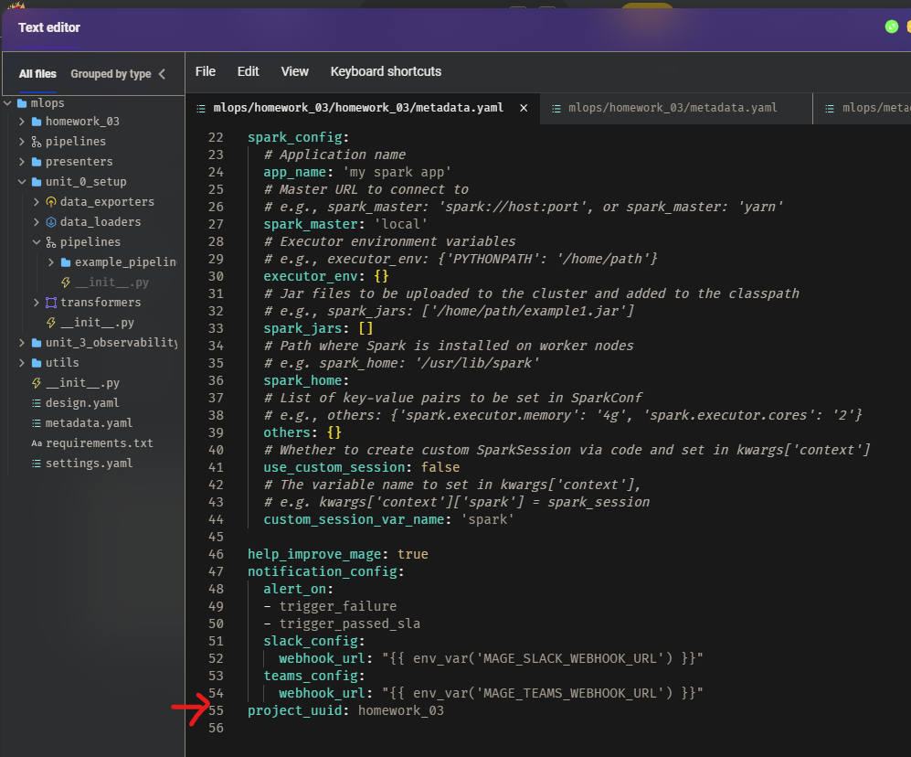
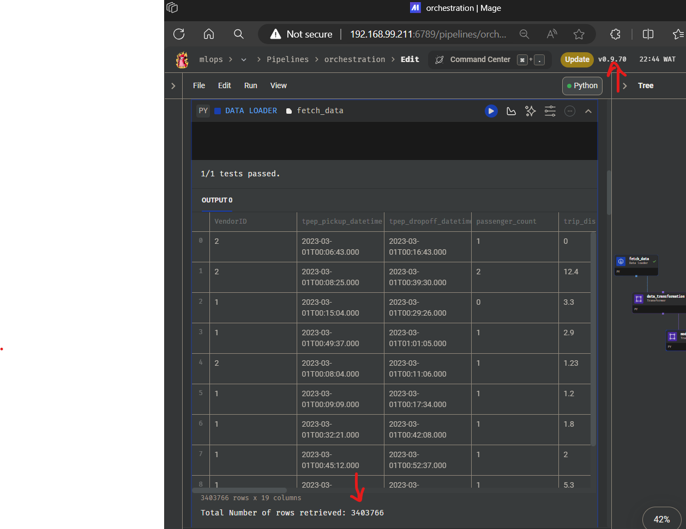
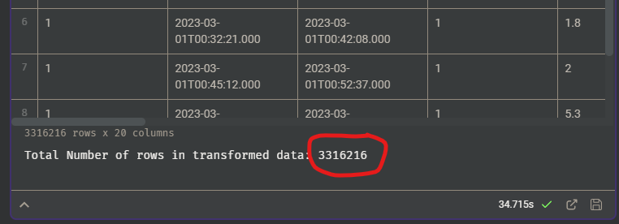
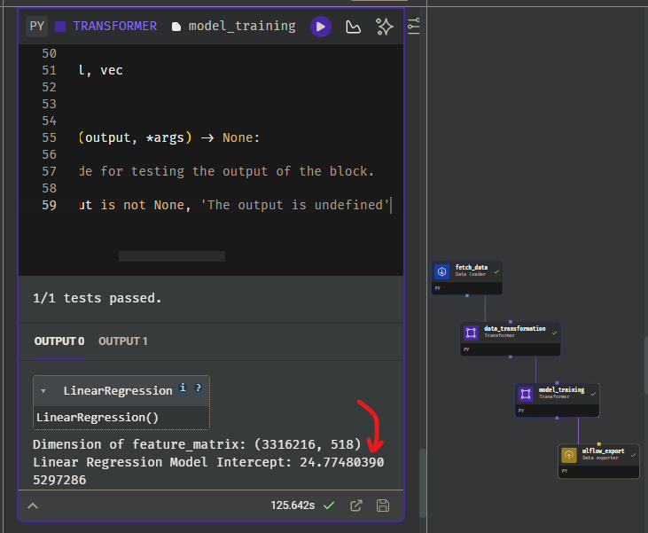
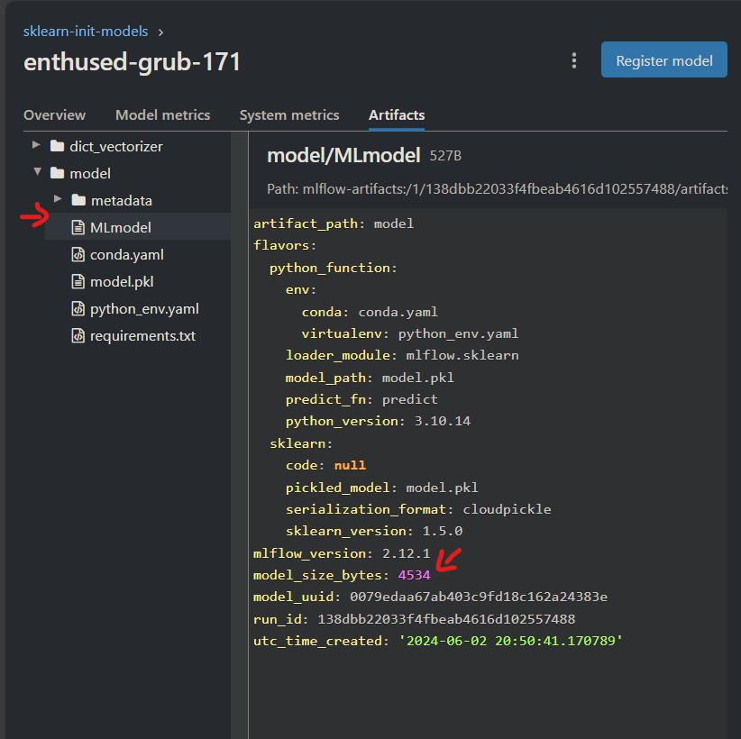

This week, we learn about **Orchestration**, simply put, how to handle the data transaformation, wrangling, et.al
but moving the outputs - models through the various mechanisms where we can then review, register, update, deploy.

The tools used were primarily 
1. Mage for orchestrating the data loading, transformation and deployment,
2. MLFlow for storing these models
3. Docker & Git for containerizing and version control.

Here, I'd just discuss the assignments and how you can set things up for the homework, will likely save anyone the troubles I went through.

First, we can launch git bash in our directory and create a sub-directory for this week's assignment.
Let's can it `wk3`, `cd wk3` to get into that directory.

Visit the **Mage** repo here https://github.com/mage-ai/mlops , now follow this closely:
1. Run `git clone https://github.com/mage-ai/mlops.git` in your git bash - this will clone the repository into a folder called "mlops"
2. Run `cd mlops` to enter it.
3. Now, create a file called `mlflow.dockerfile` and paste the following:
```
FROM python:3.10-slim

RUN pip install mlflow==2.12.1

EXPOSE 5000

CMD [ \
    "mlflow", "server", \
    "--backend-store-uri", "sqlite:///home/mlflow/mlflow.db", \
    "--default-artifact-root, ./artifacts", \
    "--host", "0.0.0.0", \
    "--port", "5000" \
]
```
Next, look for the `docker-compose.yml` file and modify it like so:
```
...
  mlflow:
    build:
      context: .
      dockerfile: mlflow.dockerfile
    ports:
      - "5000:5000"
    volumes:
      - "${PWD}/mlflow:/home/mlflow/"
    networks:
      - app-network
...
```
Zooming out should look like:


This is to ensure both Mage http://localhost:6789/  and Mlflow http://localhost:5000/ can run concurrently when you open them at launch. (If there's a better way please raise an issue).
4. Now, Run `./scripts/start.sh`

Phew, now you are go-to-go and set to start the exercises.
While the code to achieve the tasks are present in this repo, I encourage you to exhaust your options before prying.

q2. 
q3. 
q4. 
q5. 
q6. 

Other trouble-shooting: 
alternate between 'http://localhost/' to your IP Address or 'http://127.0.0.1/'